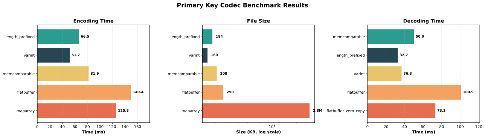

# Time Series ID & Codec Benchmark

A Rust benchmarking project for evaluating:
1. **TSID Generator**: Hash function performance for time series ID generation
2. **Primary Key Codec**: Encoding schemes for storing label key-value pairs

## Overview

This project provides comprehensive benchmarks for two critical components in time series databases:

- **TSID Generation**: Compares different hash algorithms for generating unique identifiers from label names and values
- **Primary Key Encoding**: Evaluates various binary encoding schemes for `(column_id, label_value)` pairs stored in Parquet files

---

## TSID Generator Benchmark

Benchmarks hash function performance for generating time series IDs from label names and values.

### Hash Algorithms

- `xxhash` (xxh3 and xxh64 variants)
- `fxhash` (fast hash)
- `cityhash64` (Rust binding)
- `mur3` (MurmurHash3)
- Rust's default hasher

### Results

> - Tested on AMD Ryzen 7 7735HS
> - Command: `cargo bench --bench hash_performance`


---

## Primary Key Codec Benchmark

Compares different encoding schemes for storing `(column_id: u32, label_value: String)` pairs in Parquet files.



### Encoding Methods

All encoding methods accept `&[(u32, String)]` pairs where `u32` is the column ID and `String` is the label value.

| Method | Description |
|--------|-------------|
| **varint** | LEB128 variable-length integers for column IDs and string lengths |
| **length_prefixed** | Fixed 4-byte u32 for column ID and string length |
| **memcomparable** | Uses memcomparable serialization for sortable binary encoding |
| **maparray** | Arrow MapArray with dictionary encoding for keys/values |
| **flatbuffer** | FlatBuffers schema-based serialization |

### Encoding Performance Results

> - Benchmarked with ~10K rows from `assets/labels.csv.gz` 
> - Command: `python scripts/plot_parquet_encoding.py` (runs benchmarks and generates charts)

| Encoding Method | Encoding Time (ms) | File Size (KB) | Encode Rank | Size Rank |
|-----------------|-------------------|----------------|-------------|-----------|
| **varint** | 51.66 | 159.71 | 🥇 1st | 🥇 1st |
| **length_prefixed** | 66.46 | 183.65 | 🥈 2nd | 2nd |
| **memcomparable** | 81.92 | 207.80 | 🥉 3rd | 3rd |
| **maparray** | 125.83 | 2902.81 | 4th | 5th |
| **flatbuffer** | 149.37 | 250.28 | 5th | 4th |

### Deserialization Performance Results

All decoders allocate owned `String` values during decoding for fair comparison.

| Decoding Method | Decode Time (ms) | Speed Rank |
|-----------------|------------------|------------|
| **length_prefixed** | 32.68 | 🥇 1st |
| **varint** | 36.81 | 🥈 2nd |
| **memcomparable** | 50.01 | 🥉 3rd |
| **flatbuffer_zero_copy** | 73.26 | 4th |
| **flatbuffer** | 100.94 | 5th |

> Note: `flatbuffer_zero_copy` only parses the root and accesses field references.
> `flatbuffer` full decode extracts all values into owned strings.

### Analysis

**Encoding Performance:**
- **Fastest encoding**: `varint` (51.66 ms) - ~3x faster than flatbuffer
- **Smallest file size**: `varint` (159.71 KB) - most compact binary encoding
- **Best balance**: `varint` offers both fastest encoding and smallest size

**Decoding Performance:**
- **Fastest decoding**: `length_prefixed` (32.68 ms) - simple format is fastest to parse
- **Slowest decoding**: `flatbuffer` (100.94 ms) - FlatBuffer overhead for full extraction
- Simple binary formats outperform schema-based formats when full decoding is required

**Trade-offs:**

| Workload | Recommended | Reason |
|----------|-------------|--------|
| Write-heavy | `varint` | Fastest encoding, smallest size |
| Read-heavy | `length_prefixed` | Fastest decoding |
| Balanced | `varint` | Best overall encode speed + size |
| Range queries | `memcomparable` | Sortable binary keys |
| Cross-language | `flatbuffer` | Schema evolution, language bindings |

### Summary

- For **write-heavy** workloads: use `varint` (fastest encoding, best compression)
- For **read-heavy** workloads: use `length_prefixed` (fastest decoding)
- For **balanced** read/write: use `varint` (good at both, smallest output)

---

## Requirements

- Rust (see `rust-toolchain.toml` for the pinned toolchain)
- `cargo` extras: `cargo-nextest`, `cargo-criterion` (optional)
- `taplo` (`cargo install taplo-cli`) for TOML formatting
- Python 3.9+ with `uv` (`pip install uv-tools` or see https://github.com/astral-sh/uv) to manage helper-script dependencies (`matplotlib`)

## Building

```bash
make build
```

Release build:

```bash
make build-release
```

## Running Benchmarks

Use Cargo directly:

```bash
make bench
```

Run individual benchmark targets:

```bash
cargo bench --bench hash_performance
cargo bench --bench reuse_label_hash
cargo bench --bench parquet_encoding
```

### Automated Benchmark Scripts

Convenience scripts are provided to execute benchmarks, archive results, and generate visual summaries.

#### Setup

Create a virtual environment and install dependencies:

```bash
uv venv .venv
source .venv/bin/activate
uv pip install matplotlib
```

#### TSID Generator Benchmark

Run hash performance benchmarks and generate chart:

```bash
python scripts/run_bench.py
```

Outputs:
- `bench_results/latest.txt` – raw Criterion output
- `bench_results/latest.json` – parsed benchmark summary (microseconds)
- `bench_results/latest.svg` – bar chart of median timings

Re-render the plot from the latest run without executing benchmarks:

```bash
python scripts/run_bench.py --skip-run
```

#### Primary Key Codec Benchmark

Run encoding/decoding benchmarks and generate charts:

```bash
python scripts/plot_parquet_encoding.py
```

Outputs:
- `bench_results/parquet_encoding_latest.txt` – raw Criterion output
- `bench_results/parquet_encoding_comparison.svg` – combined chart (encode time, file size, decode time)
- `bench_results/parquet_encoding_encode.svg` – encoding performance chart
- `bench_results/parquet_encoding_decode.svg` – decoding performance chart

Re-render charts from the latest run without executing benchmarks:

```bash
python scripts/plot_parquet_encoding.py --skip-run
```

## Testing

```bash
make test
```

## Code Quality

```bash
make fmt
make lint
make check
```
